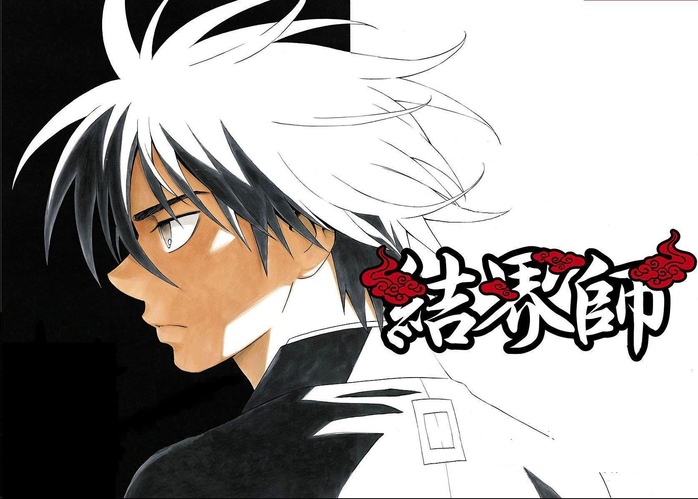

Vary Begin
===
開頭應該寫什麼(整個檔案):
---
## \<!DOCTYPE html>\</html>
## It is an instruction to the web brower about what version of HTML the page is written in.

## \<html lang="??">
## 

# Body 區
## \<h1>  主標題:<h1>Scale</h1>

## \<h2>  副標題:<h2>Scale</h2>

## \<h3>  小標題:<h3>Scale</h3>

## \
 內文: 
## 
內文內文內文

## \<ul> unordered list 無序清單 (配合 \<li> 顯示每個選項)
<ul>
 <li> 清單</li>
 <li> 清單</li>
 <li> 清單</li>
</ul>

## \<ol> ordered list 有序清單 (配合 \<li>顯示每個選項)

<ol>
    <li>步驟一</li>
    <li>步驟二</li>
    <li>步驟三</li>
</ol>

導覽列 \<nav> 配合 \<a href="網址">
---

<nav>
    <a href="">連結1</a>
    <a href="">連結2</a>
    <a href="">連結3</a>
</nav>

字體設定
---
##  粗體字 \<strong>

##  斜體字 \<em>

##  圖片 \ alt是圖片說明 src是圖片絕對位置 圖片掛掉的時候會顯示alt的內容

## 利用\<figure>配合 <figcaption>填入圖片描述，再用css將其隱藏(寫是為了搜尋引擎好)
<figure>
    
    <figcaption>
        這是漫畫"結界師"其中一個章節(極限無想)封面，這是主角叫做良守
    </figcaption>
</figure>

## \<table> 製作網格(通常先從row(\<tr>)開始，再來是col(\<td>))

<table border="2">
    <tr>
        <td>11</td>
        <td>12</td>
        <td>13</td>
        <td>14</td>
        <td>15</td>
    </tr>
    <tr>
        <td>21</td>
        <td>22</td>
        <td>23</td>
        <td>24</td>
        <td>25</td>
    </tr>
    <tr>
        <td>31</td>
        <td>32</td>
        <td>33</td>
        <td>34</td>
        <td>35</td>
    </tr>
</table>
